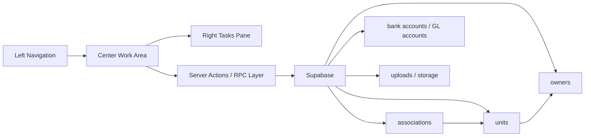

# Project Graph

This graph will be updated as each screen is wired.

## Current Wiring Targets

| Screen | UI Route | Primary Tables | Status |
| --- | --- | --- | --- |
| Associations Directory | `/associations` | `associations`, `units` | Pending wiring review |
| New Association | `/associations/new` | `associations`, accounting tables, `units`, `owners`, storage | Pending wiring review |
| Homeowners Directory | `/owners` | `owners`, `occupancies`, `units`, `associations` | Screenshot captured |
| Owners Directory | `/owners?view=directory` | `owners`, `management_agreements`, `documents` | Screenshot captured |
| Vendors Directory | `/vendors` | `vendors`, `vendor_compliance`, `documents`, `payment_methods` | Screenshot captured |
| Send Email Homeowners | Modal / future route | `owners`, `email_queue`, `communication_messages` | Screenshot captured |
| Move In Homeowner | Future route | `owners`, `occupancies`, `units`, `associations`, `documents` | Needs terminology decision |
