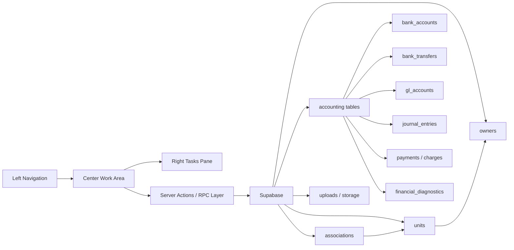

# Project Graph

This graph will be updated as each screen is wired.

## Current Wiring Targets

| Screen | UI Route | Primary Tables | Status |
| --- | --- | --- | --- |
| Associations Directory | `/associations` | `associations`, `units` | Pending wiring review |
| New Association | `/associations/new` | `associations`, accounting tables, `units`, `owners`, storage | Pending wiring review |
| Homeowners Directory | `/owners` | `owners`, `occupancies`, `units`, `associations` | Screenshot captured |
| Owners Directory | `/owners?view=directory` | `owners`, `management_agreements`, `documents` | Screenshot captured |
| Vendors Directory | `/vendors` | `vendors`, `vendor_compliance`, `documents`, `payment_methods` | Screenshot captured |
| Send Email Homeowners | Modal / future route | `owners`, `email_queue`, `communication_messages` | Screenshot captured |
| Move In Homeowner | Future route | `owners`, `occupancies`, `units`, `associations`, `documents` | Needs terminology decision |
| Accounting Receipts | `/charges` | `payments`, `payment_applications`, `charges`, `owners`, `units`, `associations`, `gl_accounts` | Initial UI aligned |
| Accounting Bank Accounts | `/bank-accounts` | `bank_accounts`, `associations`, `bank_reconciliations`, `bank_feed_connections` | Initial UI aligned |
| Accounting Bank Transfers | `/bank-transfers` | `bank_transfers`, `bank_accounts`, `associations`, `journal_entries` | Initial UI aligned |
| Accounting Journal Entries | `/journal-entries` | `journal_entries`, `journal_entry_lines`, `gl_accounts`, `associations` | Initial UI aligned |
| Accounting GL Accounts | `/gl-accounts` | `gl_accounts`, `gl_account_permissions`, `journal_entry_lines` | Initial UI aligned |
| Accounting Financial Diagnostics | `/diagnostics` | `financial_diagnostics`, `bank_accounts`, `gl_accounts`, `charges`, `payments`, `associations` | Initial UI aligned; source table review pending |
