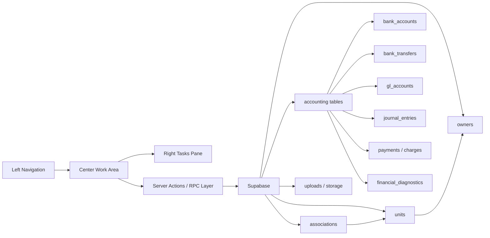

# Project Graph

This graph will be updated as each screen is wired.

## Current Wiring Targets

| Screen | UI Route | Primary Tables | Status |
| --- | --- | --- | --- |
| Associations Directory | `/associations` | `associations`, `units` | Pending wiring review |
| New Association | `/associations/new` | `associations`, accounting tables, `units`, `owners`, storage | Pending wiring review |
| Homeowners Directory | `/owners` | `owners`, `occupancies`, `units`, `associations` | Screenshot captured |
| Owners Directory | `/owners?view=directory` | `owners`, `management_agreements`, `documents` | Screenshot captured |
| Management Agreements | `/owners/management-agreements`, `/owners/management-agreements/new` | `management_agreements`, `owners`, `associations` | Lists and writes agreement drafts |
| Owner Forms | `/owners/forms` | `owners`, `user_invitations`, `document_requests`, `communication_messages`, `email_queue` | Stages owner form drafts; portal activation calls the homeowner invitation RPC |
| Vendors Directory | `/vendors` | `vendors`, `vendor_compliance`, `documents`, `payment_methods` | Screenshot captured |
| Vendor Forms | `/vendors/forms` | `vendors`, `document_requests`, `communication_messages`, `email_queue` | Stages vendor intake, W-9, bank, and compliance document requests |
| New Violation | `/violations/new` | `violations`, `associations`, `units`, `owners` | Writes violation draft to Supabase |
| Send Email Homeowners | Modal / future route | `owners`, `email_queue`, `communication_messages` | Screenshot captured |
| Move In Homeowner | Future route | `owners`, `occupancies`, `units`, `associations`, `documents` | Needs terminology decision |
| Accounting Receipts | `/charges` | `payments`, `payment_applications`, `charges`, `owners`, `units`, `associations`, `gl_accounts` | Initial UI aligned |
| Accounting Bank Accounts | `/bank-accounts` | `bank_accounts`, `associations`, `bank_reconciliations`, `bank_feed_connections` | Initial UI aligned |
| Accounting Bank Transfers | `/bank-transfers` | `bank_transfers`, `bank_accounts`, `associations`, `journal_entries` | Initial UI aligned |
| Accounting Journal Entries | `/journal-entries` | `journal_entries`, `journal_lines`, `gl_accounts`, `associations` | Initial UI aligned |
| Accounting GL Accounts | `/gl-accounts` | `gl_accounts`, `gl_account_permissions`, `journal_lines` | Initial UI aligned |
| Accounting Financial Diagnostics | `/diagnostics` | `financial_diagnostics`, `bank_accounts`, `gl_accounts`, `charges`, `payments`, `associations` | Initial UI aligned; source table review pending |
| Homeowner Receipt | `/payments/new` | `payments`, `units`, `bank_accounts`, `gl_accounts` | Writes to Supabase |
| Homeowner Charge | `/charges/new` | `charges` via `post_ad_hoc_charge`, `charge_categories`, `units` | Writes to Supabase |
| Bank Transfer | `/bank-transfers/new` | `bank_transfers`, `bank_accounts` | Writes to Supabase |
| New Journal Entry | `/journal-entries/new` | `journal_entries`, `journal_lines`, `gl_accounts`, `associations` | Writes to Supabase |
| New GL Account | `/gl-accounts/new` | `gl_accounts`, `associations` | Writes to Supabase |
| GL Account Permissions | `/gl-accounts/permissions` | `gl_account_role_permissions`, `gl_accounts`, `user_roles` | Writes to Supabase |
| Reactivate GL Account | `/gl-accounts/reactivate` | `gl_accounts` | Updates inactive accounts |
| New Bank Deposit | `/bank-accounts/deposits/new` | `payments`, `bank_accounts` | Assigns receipts to bank account |
| Bank Account Online Payments | `/bank-accounts/online-payments` | `bank_accounts.payments_enabled` | Updates payment enablement |
| Link With Bank | `/bank-accounts/link` | `bank_accounts.auto_reconciliation` | Updates feed/reconciliation flag |
| Bank Reconciliation | `/bank-accounts/reconcile` | `payments`, `payable_bills`, `bank_transfers`, `bank_accounts.last_reconciliation_date` | Updates reconciliation date after balanced guardrails pass |
| Apply Credits | `/credits/apply` | `v_unapplied_credits`, `aged_receivables`, `payment_applications` via `apply_payment` | Writes to Supabase |
| Charge Late Fees | `/charges/late-fees` | `v_charge_balances`, `apply_late_fees` | Posts late fees through existing RPC |
| Bulk Recurring Charges | `/charges/recurring/bulk` | `v_unit_charge_schedule`, `post_unit_recurring_charges` | Posts due recurring charges through existing RPC |
| Common Charge | `/charges/common/new` | `associations`, `units`, `charge_categories`, `post_ad_hoc_charge` | Posts same charge to all active units in an association |
| Lockbox | `/lockbox`, `/lockbox/new` | `lockbox_batches`, `lockbox_items`, `payments`, `bank_accounts`, `units`, `associations` | Writes batches, items, and matched receipts |
| Recurring Journal Entries | `/journal-entries/recurring`, `/journal-entries/recurring/new` | `recurring_journal_entries`, `gl_accounts`, `generate_recurring_journal_entries` | Writes recurring templates and can generate due entries |
| Journal Entry Batches | `/journal-entries/batches`, `/journal-entries/batches/new` | `journal_entry_batches` | Writes batch metadata |
| Manually Post Journal Entries | `/journal-entries/post` | `journal_entries` | Updates selected drafts to posted |
