# Screen Map

This file maps each approved reference screen to Portier behavior and Supabase wiring.

## Associations Directory

Screenshot:

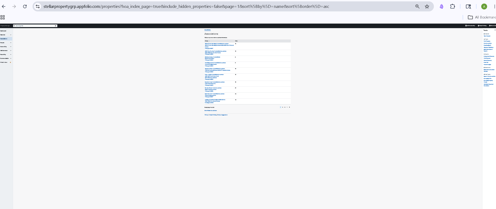

Layout:

- Left pane: Associations selected.
- Center pane: association directory table.
- Right pane: contextual Tasks.

Center pane:

- Title: Associations.
- Instruction: click row to view association information.
- Table columns:
  - Name
  - Units
- Row content:
  - association name
  - street address
  - city/state/zip
  - unit count
- Pagination.
- Show hidden associations link/filter.

Right pane groups:

- Calendar
- Tasks
- Reports
- Statements
- Help Topics

Supabase wiring:

- `associations`
- `units` aggregate by association

Status:

- Approved from saved screenshot.
- Not fully wired yet.

## Dashboard

Screenshot:

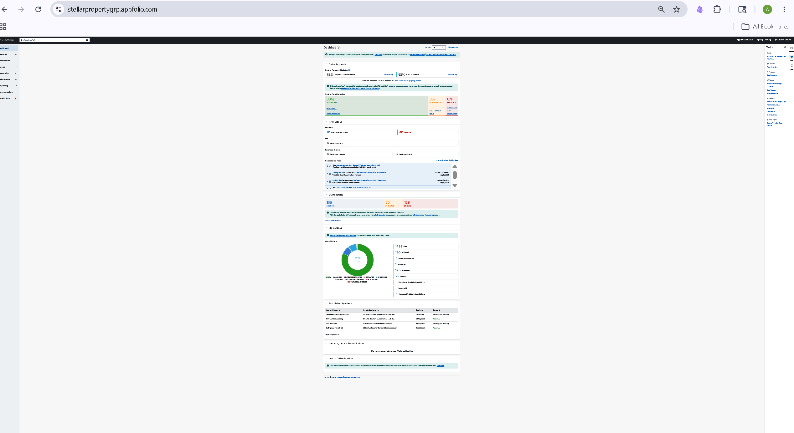

Layout:

- Left pane: Dashboard selected.
- Center pane: operational dashboard blocks stacked vertically.
- Right pane: contextual Tasks.

Center pane:

- Online Payments
- Online Portal Adoption
- Notifications
- Maintenance
- Association Approvals
- Upcoming Income Recertifications
- Vendor Online Payables

Right pane:

- Setup
- Calendar
- Property/Association shortcuts
- In Reports
- Help Topics

Supabase wiring:

- `associations`
- `payments`
- `owners`
- `occupancies`
- `work_orders`
- `approval_requests`
- `vendors`
- reporting views

Status:

- Captured from saved screenshot.
- Needs comparison before implementation.

## Homeowners Directory

Screenshot:

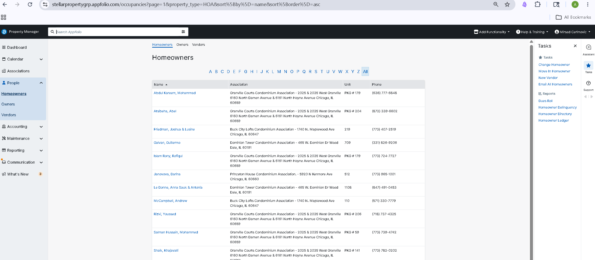

Layout:

- Left pane: People expanded, Homeowners selected.
- Center pane: Homeowners directory.
- Right pane: contextual Tasks and Reports.

Center pane:

- Top tabs: Homeowners, Owners, Vendors.
- Title: Homeowners.
- Alphabet filter A-Z and All.
- Table columns:
  - Name
  - Association
  - Unit
  - Phone
- Pagination.

Right pane:

- Tasks:
  - Change Homeowner
  - Move In Homeowner
  - New Vendor
  - Email All Homeowners
- Reports:
  - Dues Roll
  - Homeowner Delinquency
  - Homeowner Directory
  - Homeowner Ledger

Supabase wiring:

- `owners`
- `occupancies`
- `units`
- `associations`

Status:

- Approved from saved screenshot.
- Directory page should be simplified to match.

## Owners Directory

Screenshot:

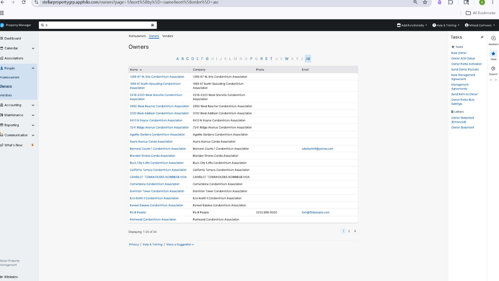

Layout:

- Left pane: People expanded, Owners selected.
- Center pane: Owners directory.
- Right pane: contextual Tasks, Letters, and reports.

Center pane:

- Top tabs: Homeowners, Owners, Vendors.
- Title: Owners.
- Alphabet filter A-Z and All.
- Table columns:
  - Name
  - Company
  - Phone
  - Email
- Pagination.

Right pane:

- Tasks:
  - New Owner
  - Owner ACH Setup
  - Owner Portal Activation
  - Send Owner Packets
  - New Management Agreement
  - Management Agreements
  - Send Form to Owner
  - Owner Portal Bulk Settings
- Letters:
  - Owner Statement (Enhanced)
  - Owner Statement

Supabase wiring:

- `owners`
- `management_agreements`
- `user_invitations`
- `documents`

Status:

- Approved from saved screenshot.
- Directory page should be simplified to match.

## Vendors Directory

Screenshot:

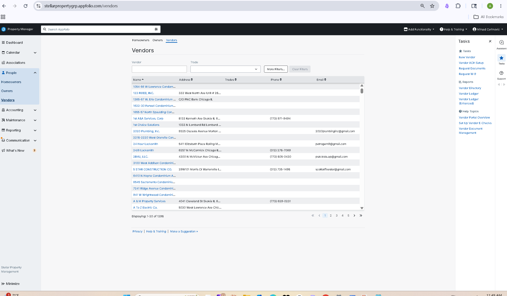

Layout:

- Left pane: People expanded, Vendors selected.
- Center pane: Vendors directory.
- Right pane: contextual Tasks, Reports, and Help Topics.

Center pane:

- Top tabs: Homeowners, Owners, Vendors.
- Title: Vendors.
- Filters:
  - Vendor text input
  - Trade dropdown
  - More Filters
  - Clear Filters
- Table columns:
  - Name
  - Address
  - Trades
  - Phone
  - Email
- Pagination.

Right pane:

- Tasks:
  - New Vendor
  - Vendor ACH Setup
  - Request Documents
  - Request W-9
- Reports:
  - Vendor Directory
  - Vendor Ledger
  - Vendor Ledger (Enhanced)
- Help Topics:
  - Vendor Portal Overview
  - Set Up Vendor E-Checks
  - Vendor Document Management

Supabase wiring:

- `vendors`
- `vendor_compliance`
- `documents`
- `payment_methods`

Status:

- Approved from saved screenshot.
- Directory page should be simplified to match.

## Send Email Homeowners Modal

Screenshot:

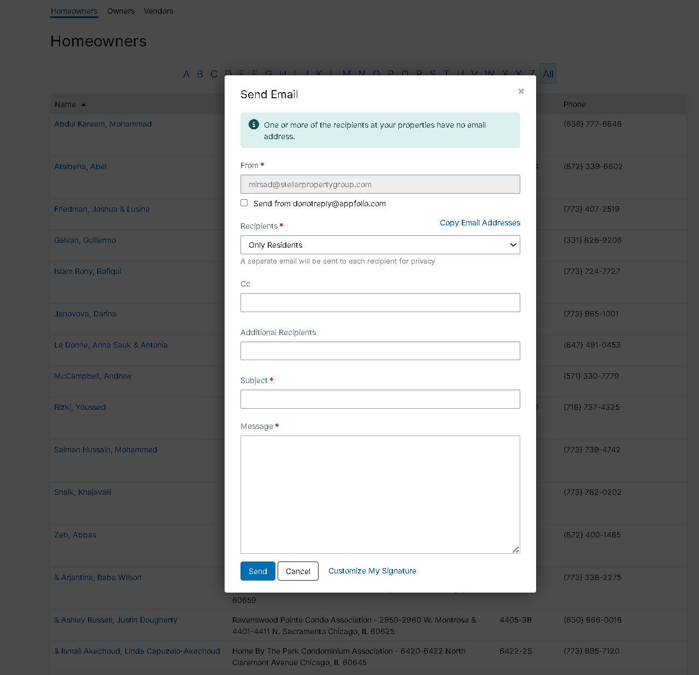

Layout:

- Modal over Homeowners directory.

Center modal:

- From
- Send from do-not-reply checkbox
- Recipients dropdown
- Copy Email Addresses link
- CC
- Additional Recipients
- Subject
- Message
- Send
- Cancel
- Customize My Signature

Supabase wiring:

- `owners`
- `email_queue`
- `communication_messages`
- `documents` or templates if signatures are stored there

Status:

- Captured from saved screenshot.
- Needs implementation review.

## Move In Homeowner

Screenshot:

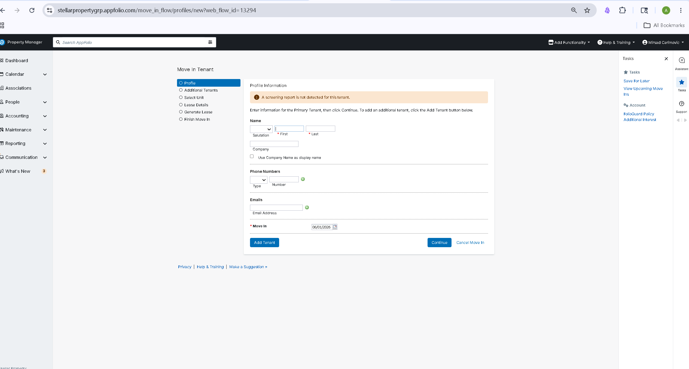

Layout:

- Left pane: People.
- Center pane: move-in wizard.
- Right pane: contextual Tasks and Account.

Center pane:

- Wizard steps:
  - Profile
  - Additional Tenants/Homeowners
  - Select Unit
  - Lease Details/Association Details needs product decision
  - Generate Lease/Generate Documents needs product decision
  - Finish Move In
- Profile information card:
  - name
  - company
  - phone numbers
  - emails
  - move-in date

Supabase wiring:

- `owners`
- `occupancies`
- `units`
- `associations`
- `documents`

Status:

- Captured from saved screenshot.
- Needs terminology decision before implementation because screenshot uses tenant/lease language.

## New Association

Screenshot:

- Captured in chat, file not yet saved locally.

Layout:

- Left pane: Associations.
- Center pane: New Association form.
- Right pane: contextual Tasks/Help.

Center pane:

- Association Details
- Bank Accounts
- Recurring Charge Settings
- Management Fee
- Late Fee Policy
- Images / Photos
- Import Units and Homeowners Spreadsheet
- Save / Create Association

Supabase wiring:

- `associations`
- bank account tables
- GL/accounting tables
- `units`
- `owners`
- storage/upload tables or Supabase Storage

Status:

- Approved from screenshot.
- Not fully wired yet.

## Accounting Shared Pattern

Screenshots:

- 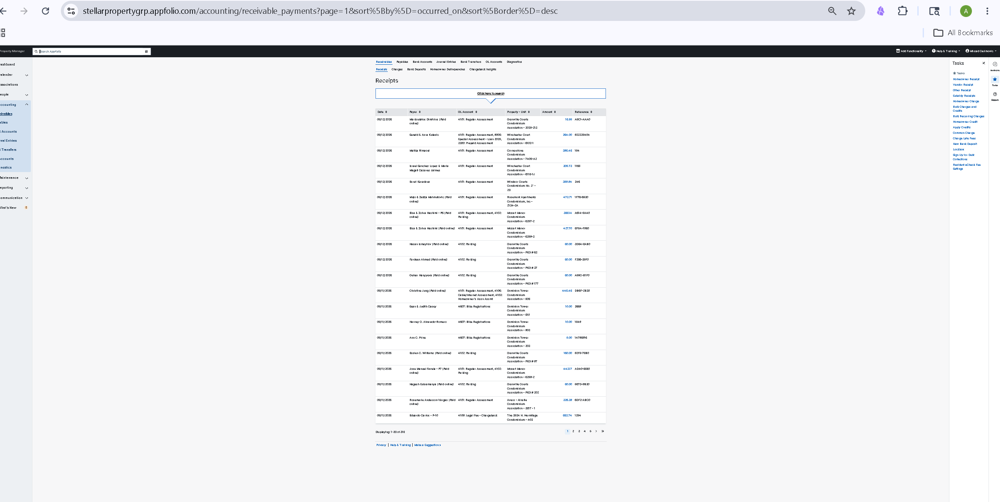
- 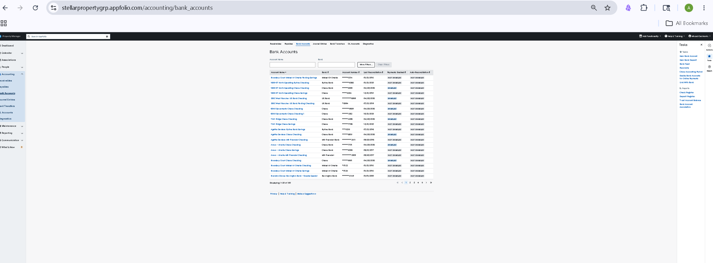
- 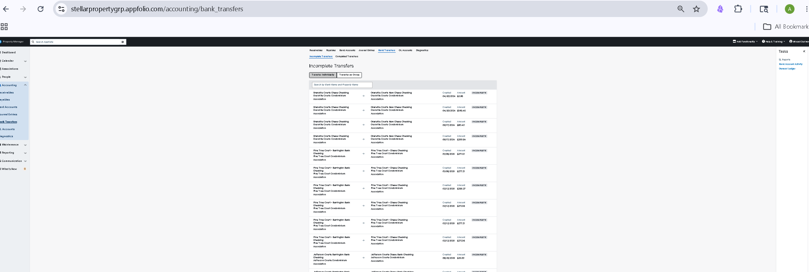
- 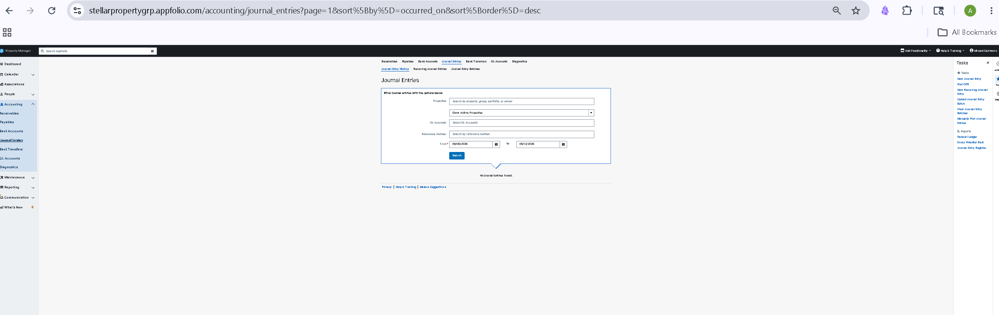
- 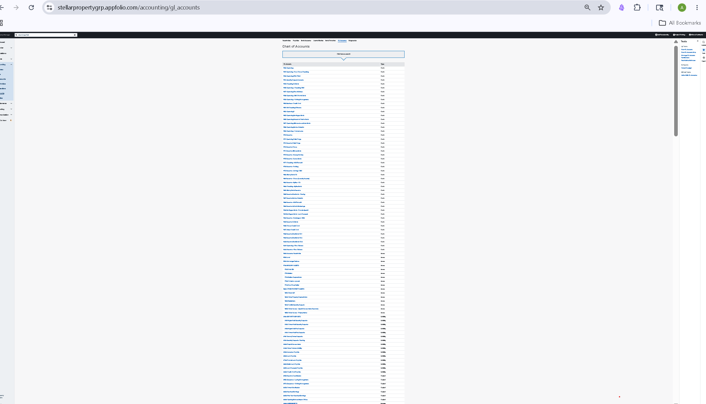
- 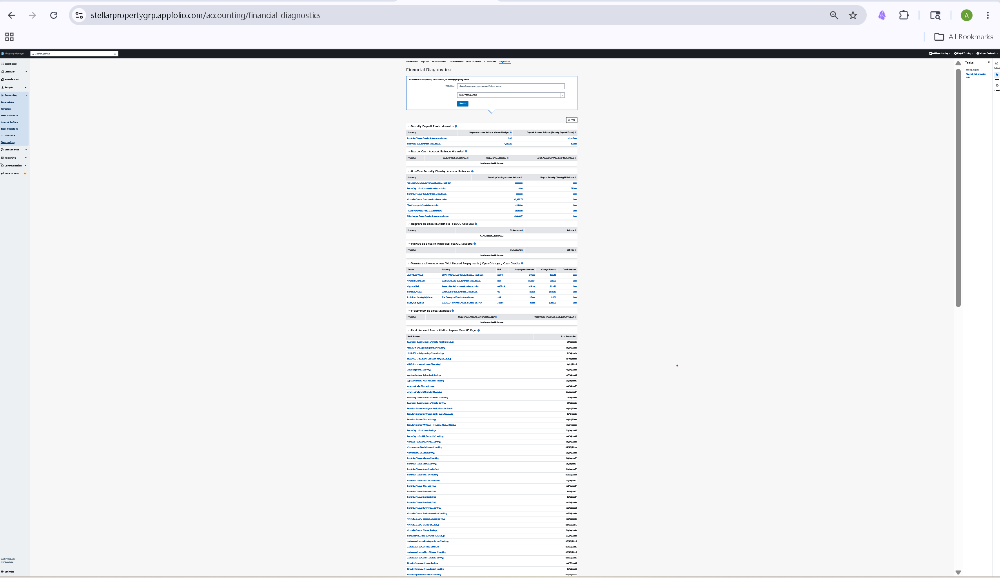

Layout:

- Left pane: Accounting expanded with the current accounting item selected.
- Center pane: accounting tabs across the top, then the selected accounting workflow.
- Right pane: contextual Tasks / Reports / Help Topics only.

Center accounting tabs:

- Receivables
- Payables
- Bank Accounts
- Journal Entries
- Bank Transfers
- GL Accounts
- Diagnostics

Design note:

- These pages should stay plain and operational: compact filters, search boxes, tables, pagination, and forms.
- Do not add dashboard metric strips or marketing-style descriptions to these accounting list screens.

Status:

- Approved reference batch saved locally.
- UI comparison complete; implementation pending.

## Accounting Receipts

Screenshot:


Center pane:

- Receivables tab active.
- Receivables subtabs:
  - Receipts
  - Charges
  - Bank Deposits
  - Homeowner Delinquencies
  - Chargeback Insights
- Title: Receipts.
- Search box.
- Table columns:
  - Date
  - Payer
  - GL Account
  - Association - Unit
  - Amount
  - Reference
- Pagination.

Right pane:

- Homeowner Receipt
- Vendor Receipt
- Other Receipt
- Subsidy Receipt
- Homeowner Charge
- Bulk Charges and Credits
- Bulk Recurring Charges
- Homeowner Credit
- Apply Credits
- Common Charge
- Charge Late Fees
- New Bank Deposit
- Lockbox
- Sign Up for Debt Collections
- Resident Check Fee Settings

Supabase wiring:

- `payments`
- `payment_applications`
- `charges`
- `owners`
- `units`
- `associations`
- `gl_accounts`
- `bank_accounts`

Status:

- Captured from saved screenshot.
- Current app needs route/workflow review.

## Accounting Bank Accounts

Screenshot:


Center pane:

- Bank Accounts tab active.
- Title: Bank Accounts.
- Filters:
  - Account Name
  - Bank
  - More Filters
  - Clear Filters
- Table columns:
  - Account Name
  - Bank
  - Account Number
  - Last Reconciliation
  - Payments Enabled
  - Auto-Reconciliation
- Pagination.

Right pane:

- New Bank Account
- New Bank Deposit
- Bank Feed
- Reconcile
- Close Accounting Period
- Enable Bank Accounts for Online Payments
- Link With Bank
- Reports:
  - Check Register
  - Deposit Register
  - Trust Account Balance
  - Bank Account Association

Supabase wiring:

- `bank_accounts`
- `associations`
- `bank_reconciliations`
- `bank_feed_connections`

Status:

- Captured from saved screenshot.
- Current app is wired but center pane has extra dashboard-style elements to remove in a later UI pass.

## Accounting Bank Transfers

Screenshot:


Center pane:

- Bank Transfers tab active.
- Subtabs:
  - Incomplete Transfers
  - Completed Transfers
- Title: Incomplete Transfers.
- Actions:
  - Transfer Individually
  - Transfer as Group
- Search by bank name and association name.
- Transfer rows show:
  - source bank account / association
  - destination bank account / association
  - created date
  - amount
  - incomplete status

Right pane:

- Reports:
  - Bank Account Activity
  - General Ledger

Supabase wiring:

- `bank_transfers`
- `bank_accounts`
- `associations`
- `journal_entries`

Status:

- Captured from saved screenshot.
- Current app has a transfer table but needs incomplete/completed workflow shape.

## Accounting Journal Entries

Screenshot:


Center pane:

- Journal Entries tab active.
- Subtabs:
  - Journal Entry History
  - Recurring Journal Entries
  - Journal Entry Batches
- Title: Journal Entries.
- Filters:
  - Property/Association search
  - Show active/inactive associations
  - GL Accounts
  - Reference Number
  - From / To dates
- Results area.

Right pane:

- New Journal Entry
- Post GPR
- New Recurring Journal Entry
- Upload Journal Entry Batch
- View Journal Entry Batches
- Manually Post Journal Entries
- Reports:
  - General Ledger
  - Gross Potential Rent
  - Journal Entry Register

Supabase wiring:

- `journal_entries`
- `journal_entry_lines`
- `gl_accounts`
- `associations`
- `recurring_journal_entries`
- `journal_entry_batches`

Status:

- Captured from saved screenshot.
- Current app has a basic journal-entry table but not the reference filter workflow.

## Accounting GL Accounts

Screenshot:


Center pane:

- GL Accounts tab active.
- Title: Chart of Accounts.
- Search box.
- Flat table columns:
  - GL Account
  - Type

Right pane:

- Tasks:
  - New GL Account
  - New GL Account Map
  - Manage GL Account Permissions
  - Reactivate GL Account
- Reports:
  - General Ledger
- Help Topics:
  - Add or Edit GL Accounts

Supabase wiring:

- `gl_accounts`
- `gl_account_permissions`
- `journal_entry_lines`

Status:

- Captured from saved screenshot.
- Current app groups accounts by range; reference uses a flat chart list.

## Accounting Financial Diagnostics

Screenshot:


Center pane:

- Diagnostics tab active.
- Title: Financial Diagnostics.
- Filters:
  - association/property search
  - show all associations
- Print action.
- Diagnostic sections:
  - Security Deposit Funds Mismatch
  - Escrow Cash Account Balance Mismatch
  - Non-Zero Security Clearing Account Balances
  - Negative Balance on Additional Fee GL Accounts
  - Positive Balance on Additional Fee GL Accounts
  - Tenants and Homeowners With Unused Prepayments / Open Charges / Open Credits
  - Prepayment Balance Mismatch
  - Bank Account Reconciliation Lapses Over 60 Days

Right pane:

- Help Topics:
  - Financial Diagnostics Help

Supabase wiring:

- `financial_diagnostics`
- `gl_accounts`
- `bank_accounts`
- `bank_reconciliations`
- `owners`
- `charges`
- `payments`
- `associations`

Status:

- Captured from saved screenshot.
- Current app shows data-quality diagnostic tiles; reference requires accounting diagnostic tables.

## Template

```markdown
## Screen Name

Screenshot:


Layout:

- Left pane:
- Center pane:
- Right pane:

Center pane:

-

Right pane:

-

Supabase wiring:

-

Keep:

-

Remove:

-

Status:

-
```
